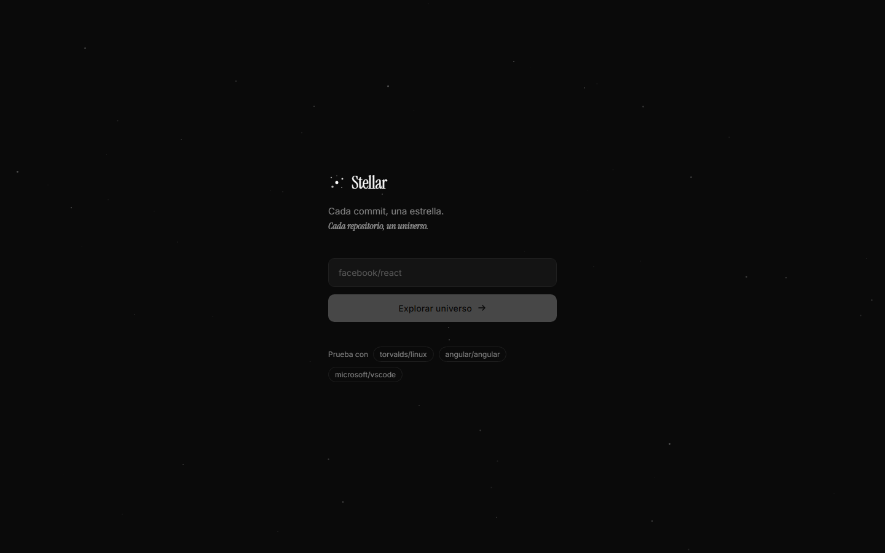
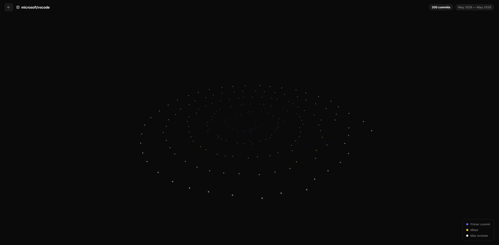

# Stellar

**Cada commit, una estrella. Cada repositorio, un universo.**


Stellar convierte el historial de commits de cualquier repositorio público de GitHub en una galaxia 3D que puedes explorar.

En `git log` todos los commits se ven iguales. Aquí se ve de un vistazo el ritmo de un proyecto:
- **Cuándo empezó y hasta dónde llega:** los commits forman una espiral en orden cronológico, del centro hacia fuera.
- **Qué es antiguo y qué reciente:** el color va del índigo (lo más antiguo) al blanco (lo más reciente).
- **Qué dice cada commit:** al pasar el ratón por una estrella se ve su mensaje, autor y fecha, y al hacer clic se abre el commit en GitHub.

## Demo

🌐 **En vivo:** [**mestepa12.github.io/stellar**](https://mestepa12.github.io/stellar/)

Prueba con `torvalds/linux`, `angular/angular` o pega la URL de cualquier repositorio público.

## Capturas

| Búsqueda | Universo de `microsoft/vscode` |
|---|---|
|  |  |

## Tecnologías

- **Angular 21**: componentes *standalone*, **signals** (`signal`, `computed`, `output`) y el nuevo control de flujo (`@switch`, `@if`)
- **Three.js** con **shaders GLSL propios** (`ShaderMaterial`) y `OrbitControls`
- **RxJS** (`forkJoin`) para pedir a la API de GitHub dos páginas en paralelo
- **TypeScript** estricto y SCSS

## Instalación y ejecución en local

**Requisitos:** Node.js 20.19+ o 22.12+ (los que exige Angular 21).

```bash
git clone https://github.com/mestepa12/stellar.git
cd stellar
npm install
npm start          # http://localhost:4200
```

```bash
npm run build      # build de producción en dist/stellar
```

No hace falta ningún token: usa la API pública de GitHub sin autenticar.

---

## Lo más destacado técnicamente

- **Un solo draw call para cientos de estrellas.** Todos los commits van en un único `THREE.Points` con atributos propios (`aSize`, `aIndex`). El resaltado al pasar el ratón se hace **en el vertex shader**, comparando el índice con un *uniform*, así que no se crea un objeto por commit ni se reconstruye la geometría.
- **Estrellas dibujadas por shader.** El fragment shader pinta cada punto como un disco con núcleo y halo (`smoothstep`) y descarta lo que queda fuera del radio. El tamaño se ajusta con la distancia a la cámara para dar sensación de perspectiva.
- **Posición estable.** La dispersión de cada estrella sale de un hash del SHA, no de `Math.random()`, así que el mismo repositorio genera siempre la misma galaxia.
- **Angular no recalcula la vista en cada fotograma.** El bucle de `requestAnimationFrame` y los eventos del ratón corren con `NgZone.runOutsideAngular`. Solo se vuelve a Angular para actualizar las *signals* que pinta la plantilla (tooltip y pista de uso).
- **Limpieza de memoria.** Al salir o cambiar de repositorio se liberan geometría, material y renderer (`dispose()`), porque Three.js no libera la memoria de la GPU por sí solo.
- **Hecho para no agotar el límite de la API.** Sin token, GitHub permite 60 peticiones por hora. Se piden como mucho 2 páginas (200 commits) en paralelo. Si falla la segunda, se muestra la primera. Los errores 404 y 403 (límite alcanzado) muestran un mensaje claro.
- **Detección con raycasting** sobre nubes de puntos, con un margen de tolerancia para que se pueda acertar a una estrella de 2 px con el ratón.
